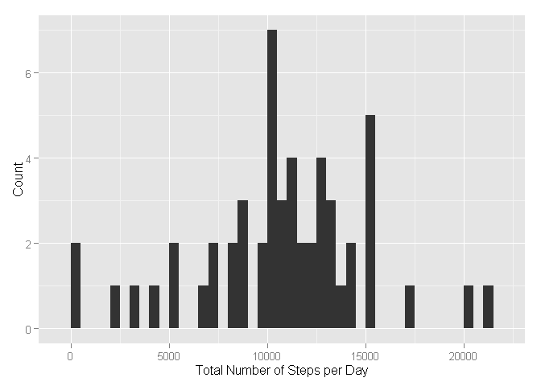
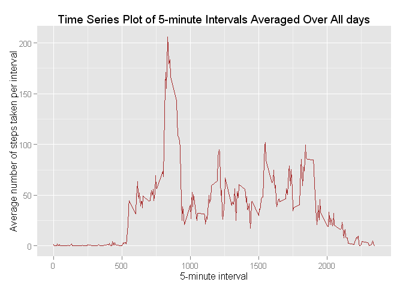
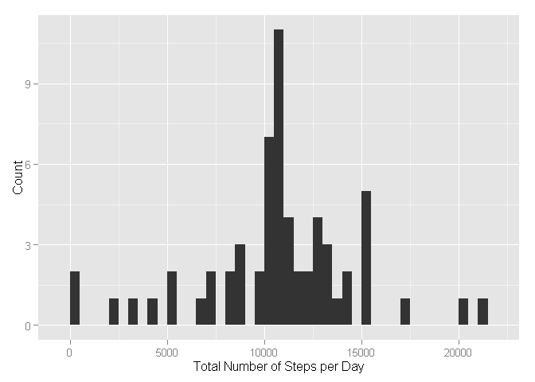
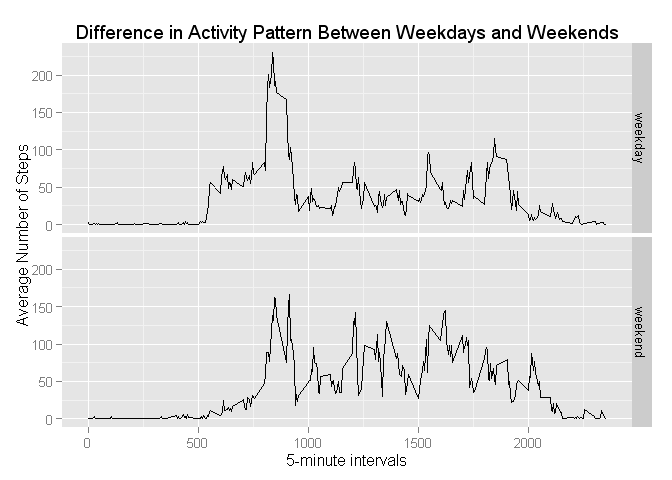

# Reproducible Research: Peer Assessment 1

### Basic settings

```r
echo = TRUE          # Always make code visible
options(scipen = 1)  # Turn off scientific notations for numbers
```

### Load Libraries

```r
library(ggplot2)
library(dplyr)
```

### Loading and preprocessing the data

```r
# Download data if not present
zip.file <- "activity.zip"
data.file <- "activity.csv"

# Check if the data file exists locally, if not retrieve and unzip
if ( !file.exists(data.file) ) {
  print("Downloading zip file...") 
  
  # Retrieve zip data from URL
  download.file("https://d396qusza40orc.cloudfront.net/repdata%2Fdata%2Factivity.zip", zip.file)
  
  # Unzip zip file
  print("Unzipping file...")       
  unzip(zip.file)  
}
```

##### 1. Load the data

```r
data <- read.csv(data.file, colClasses = c("integer", "Date", "integer"))
```

##### 2. Process/Transform the data

```r
# Remove NAs for first few questions
na.data <- na.omit(data)
```

---

### What is mean total number of steps taken per day?
For this part of the assignment, you can ignore the missing values in the dataset.

##### 1. Calculate the total number of steps taken per day

```r
StepsPerDay <- with( na.data, tapply(steps, date, sum) )
StepsPerDay
```

```
## 2012-10-02 2012-10-03 2012-10-04 2012-10-05 2012-10-06 2012-10-07 
##        126      11352      12116      13294      15420      11015 
## 2012-10-09 2012-10-10 2012-10-11 2012-10-12 2012-10-13 2012-10-14 
##      12811       9900      10304      17382      12426      15098 
## 2012-10-15 2012-10-16 2012-10-17 2012-10-18 2012-10-19 2012-10-20 
##      10139      15084      13452      10056      11829      10395 
## 2012-10-21 2012-10-22 2012-10-23 2012-10-24 2012-10-25 2012-10-26 
##       8821      13460       8918       8355       2492       6778 
## 2012-10-27 2012-10-28 2012-10-29 2012-10-30 2012-10-31 2012-11-02 
##      10119      11458       5018       9819      15414      10600 
## 2012-11-03 2012-11-05 2012-11-06 2012-11-07 2012-11-08 2012-11-11 
##      10571      10439       8334      12883       3219      12608 
## 2012-11-12 2012-11-13 2012-11-15 2012-11-16 2012-11-17 2012-11-18 
##      10765       7336         41       5441      14339      15110 
## 2012-11-19 2012-11-20 2012-11-21 2012-11-22 2012-11-23 2012-11-24 
##       8841       4472      12787      20427      21194      14478 
## 2012-11-25 2012-11-26 2012-11-27 2012-11-28 2012-11-29 
##      11834      11162      13646      10183       7047
```

##### 2. Make a histogram of the total number of steps taken each day

```r
qplot(StepsPerDay, xlab='Total Number of Steps per Day', ylab='Count', binwidth=500)
```

 

##### 3. Calculate and report the mean and median of the total number of steps taken per day

```r
mean_StepsPerDay <- mean(StepsPerDay)
median_StepsPerDay <- median(StepsPerDay)
```

* Mean Number of Steps Taken Per Day:    10766.19
* Median Number of Steps Taken Per Day:  10765

---

### What is the average daily activity pattern?

##### 1. Make a time series plot (i.e. type = "l") of the 5-minute interval (x-axis) and the average number of steps taken, averaged across all days (y-axis)


```r
# Calc Mean steps per interval
MeanStepsPerInt <- with( na.data, tapply(steps, interval, mean) )

# Generate unique set of numeric intervals
nint <- as.numeric(names(MeanStepsPerInt))

# Generate the plot
qplot(x=nint, y=MeanStepsPerInt, geom="line", color=I("brown"), xlab="5-minute interval", ylab="Average number of steps taken per interval", main="Time Series Plot of 5-minute Intervals Averaged Over All days")
```

 

##### 2. Which 5-minute interval, on average across all the days in the dataset, contains the maximum number of steps?

```r
maxval <- max(MeanStepsPerInt)
maxint <- as.numeric(names(MeanStepsPerInt[MeanStepsPerInt==maxval]))
```
* Max Value: 206.17
* Interval:  835

---

### Imputing missing values
##### 1. Calculate and report the total number of missing values in the dataset (i.e. the total number of rows with NAs)

```r
# Total no of rows with an NA present
sum(is.na(data))
```

```
## [1] 2304
```

##### 2. Devise a strategy for filling in all of the missing values in the dataset. The strategy does not need to be sophisticated. For example, you could use the mean/median for that day, or the mean for that 5-minute interval, etc.

**Some days appear to have no steps data. Therefore my preferred method is to replace the missing data with the mean value for the same 5-minute interval.**

##### 3. Create a new dataset that is equal to the original dataset but with the missing data filled in.

```r
ndata <- data
for (row in 1:nrow(ndata)) {
  if ( is.na(ndata$steps[row]) ) {
     int <- ndata$interval[row]
     ndata$steps[row] <- MeanStepsPerInt[as.character(int)]
  }
}
```

##### 4a. Make a histogram of the total number of steps taken each day

```r
NStepsPerDay <- with( ndata, tapply(steps, date, sum) )
qplot(NStepsPerDay, xlab='Total Number of Steps per Day', ylab='Count', binwidth=500)
```

 

##### 4b. Calculate and report the mean and median total number of steps taken per day. 

```r
mean_NStepsPerDay <- mean(NStepsPerDay)
median_NStepsPerDay <- median(NStepsPerDay)
```
* Mean Number of Steps Taken Per Day:    10766.19
* Median Number of Steps Taken Per Day:  10766.19

##### 4c. Do these values differ from the estimates from the first part of the assignment? 

```r
# Diff of means
mean_NStepsPerDay - mean_StepsPerDay
```

```
## [1] 0
```

```r
# Diff of medians
median_NStepsPerDay - median_StepsPerDay
```

```
## [1] 1.188679
```

So there appears to be **no difference** on the estimated mean value of Steps per Day and only **a very small difference** (slighty greater) on the estimated median value of Steps Per Day.

##### 4d. What is the impact of imputing missing data on the estimates of the total daily number of steps?
There is very little impact of imputing missing data on the estimates of the total daily number of steps using this particular method of filling in missing data. In particular there is no difference on the estimated mean value of Steps per Day and only a very small difference on the estimated median value of Steps Per Day. This is as expected from the filling in method, where missing data per 5-minute interval was replaced with the non-missing mean value. This would preserve mean values overall, and bias the reported median value towards the mean.

---

### Are there differences in activity patterns between weekdays and weekends?
For this part the weekdays() function may be of some help here. Use the dataset with the filled-in missing values for this part.

##### 1. Create a new factor variable in the dataset with two levels - "weekday" and "weekend" indicating whether a given date is a weekday or weekend.


```r
# Create new factor variable for day of week the data was recorded
ndata$dow <- as.factor(weekdays(ndata$date))

# Create new factor variable for weekday/weekend from day of week
ndata$weekday <- ndata$dow

# Check order of the factor levels
levels(ndata$weekday)
```

```
## [1] "Friday"    "Monday"    "Saturday"  "Sunday"    "Thursday"  "Tuesday"  
## [7] "Wednesday"
```

```r
# Overwrite individual days of the week with categories for "weekday" and "weekend"
levels(ndata$weekday) <- c("weekday", "weekday", "weekend", "weekend", "weekday", "weekday", "weekday")
```


##### 2. Make a panel plot containing a time series plot (i.e. type = "l") of the 5-minute interval (x-axis) and the average number of steps taken, averaged across all weekday days or weekend days (y-axis). 


```r
# Use tidyr to group and summarize data by weekday
ndata <- group_by(ndata, weekday, interval)
wndata <- summarize(ndata, steps=mean(steps))

# Plot generation
ggplot(wndata, aes(interval, steps)) + geom_line() + facet_grid(weekday ~ .) + xlab("5-minute intervals") + 
  ylab("Average Number of Steps") + ggtitle("Difference in Activity Pattern Between Weekdays and Weekends")
```

 
